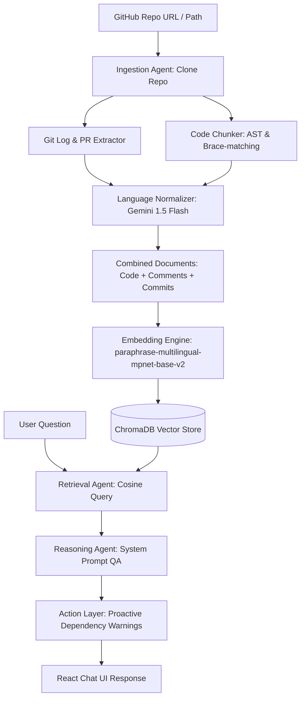

# CodeMate — AI-Powered Codebase Onboarding Agent 🚀

CodeMate is a developer onboarding companion designed to help new engineers understand a codebase. It allows developers to chat with a codebase, fetching relevant code blocks, class definitions, and git history to answer queries in context. 

CodeMate features a unique capability: it **automatically detects and normalizes multilingual / code-mixed comments and commit messages** (e.g. Hinglish, Tanglish) into standard technical English before embedding and indexing. This helps teams working in multi-regional setups where devs commonly write comments like `# login session store pannu` or `# database reset karna`.

---

## 🛠️ Architecture & Ingest Pipeline

The onboarding agent operates in a sequence of automated stages:



1. **Ingestion & Git History Extraction**: Clones the repo locally, extracts commit history, maps modified files to commit hashes, dates, messages, and authors.
2. **AST & Brace-Matching Chunking**: Instead of split line-windows, CodeMate parses Python scripts using the `ast` module to slice class and function boundaries, and uses custom brace-matching for Javascript/Typescript, ensuring code snippets retain lexical integrity.
3. **Multilingual Normalization**: Identifies comments and commit logs written in code-mixed dialects and translates them to clean technical English via Gemini 1.5 Flash, storing both original and normalized copies.
4. **Vector Storage**: Combines the raw code chunk, normalized comments, and git history context, converts them into embeddings, and saves them to ChromaDB.
5. **Retrieval & Reasoning**: Performs vector similarity search and prompts Gemini 1.5 Flash to answer Q&A queries with grounded evidence, citations, and line ranges.
6. **Proactive Dependency / Impact Warnings**: When users ask questions related to changing or editing functions (e.g., *"What happens if I change check_permission?"*), the agent automatically scans the repo for usages and references in other files to inject a dependency warning block.

---

## 📁 Repository Structure

```text
e:/CodeMate-Project/
├── backend/
│   ├── app/
│   │   ├── services/
│   │   │   ├── agent.py         # Gemini QA & Dependency Impact logic
│   │   │   ├── chunker.py       # Python AST & brace-matching chunker
│   │   │   ├── chroma_service.py # Vector indexing & querying
│   │   │   ├── git_service.py   # Repo clone & git history extraction
│   │   │   └── translator.py    # Multilingual translation using Gemini
│   │   ├── config.py            # Storage directories and API keys config
│   │   ├── main.py              # FastAPI endpoints & background tasks
│   │   └── __init__.py
│   ├── requirements.txt         # Backend dependencies list
│   └── .env                     # Configuration file for API keys
├── frontend/
│   ├── src/
│   │   ├── App.jsx              # React Dashboard & chat implementation
│   │   ├── index.css            # Dark mode, scrollbars, & grid backgrounds
│   │   └── main.jsx
│   ├── tailwind.config.js
│   ├── postcss.config.js
│   ├── index.html
│   └── package.json
└── README.md                    # Setup and guide (This file)
```

---

## ⚡ Setup & Launch Instructions

### Prerequisites
* **Python**: 3.12+
* **Node.js**: 18+
* **Git**: Installed and configured on your path

---

### 1. Backend Setup & Run

1. Navigate to the backend directory:
   ```powershell
   cd backend
   ```

2. Create a virtual environment and activate it:
   ```powershell
   python -m venv .venv
   # On Windows:
   .venv\Scripts\Activate.ps1
   # On macOS/Linux:
   source .venv/bin/activate
   ```

3. Install the dependencies (Note: `chromadb` is installed as a binary wheel package to bypass C++ compilation requirements):
   ```powershell
   pip install -r requirements.txt
   pip install chromadb --only-binary :all:
   ```

4. Configure your API credentials inside the `.env` file:
   ```env
   GEMINI_API_KEY=AIzaSy...your_gemini_api_key...
   ```

5. Run the FastAPI development server:
   ```powershell
   uvicorn app.main:app --port 8000 --reload
   ```
   *The backend will be running at:* `http://localhost:8000`

---

### 2. Frontend Setup & Run

1. Open a new terminal and navigate to the frontend directory:
   ```powershell
   cd frontend
   ```

2. Install the node modules:
   ```powershell
   npm install
   ```

3. Launch the Vite local dev server:
   ```powershell
   npm run dev -- --port 5173
   ```
   *The client interface will be available at:* `http://localhost:5173`

---

## 📡 API Endpoints Reference

### 1. `POST /api/ingest`
Starts a background worker to clone the repository, run the AST parsing, translate code-mixed comments, generate vector embeddings, and store them in ChromaDB.
* **Payload**:
  ```json
  { "repo_url": "https://github.com/owner/repo" }
  ```

### 2. `GET /api/ingest/status`
Polls the progress status of the repository ingestion.
* **Query Parameter**: `repo_url`
* **Response**:
  ```json
  {
    "status": "indexing",
    "progress": "Generating vector embeddings for 42 code chunks...",
    "total_chunks": 0,
    "error": null
  }
  ```

### 3. `POST /api/ask`
Submits a natural language question. Returns a grounded answer along with exact code source citations. Automatically triggers dependency impact warnings if modification intents are matched.
* **Payload**:
  ```json
  {
    "repo_url": "https://github.com/owner/repo",
    "question": "What happens if I change check_permission function?"
  }
  ```

### 4. `GET /api/impact/{function_name}`
Computes code linkages for a specific code identifier across files.
* **Query Parameter**: `repo_url`

---

## 🌟 Premium UX Features Included
* **Grid Pattern Dark Mode**: Glassmorphic elements, background particle grid lines, and smooth glow orbs.
* **Granular Citations Drawer**: Under each response, expand to see cards showing exactly which files, line ranges, and git commits (hash, author, date) were retrieved as evidence.
* **Step-by-step Ingestion Stepper**: Clear progress state bars showing the current ingestion pipeline step in real time.
* **Local Repo Registry**: Cached list of repositories in `localStorage` for switching between indexes.
